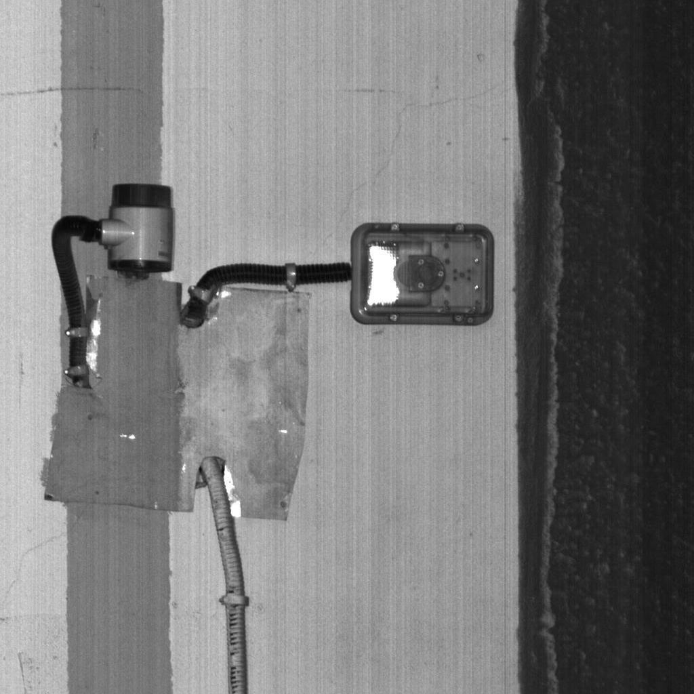
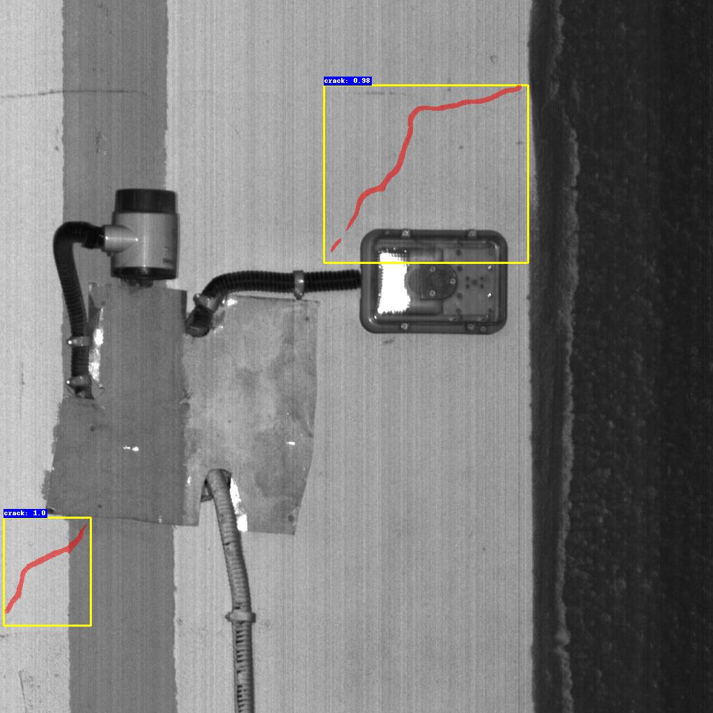

# Implementation of a Crack Causal Augmentation Framework (CCAF) and Dynamic Binary Threshold (DBT) on Mask R-CNN for Crack Instance Segmentation

We provide the codes (**Pytorch implementation**), the datasets, and the pretrained model.

## Pretrained Models

Pretrained models on PyTorch are available at
[Baidu Yun](https://pan.baidu.com/s/1ZxzhWEvcXf03aHVAqpw5Xg?pwd=oydm)

passcode: oydm

## Data

### Dataset Format

This project uses the COCO dataset format and the data should be organized as follows

```
data_root/
├── images
│   ├── xxx.png
│   ├── xxy.png
│   └── ...
└── annotations
	├── train_coco_anns.json
	└── test_coco_anns.json

```

### Dataset

CrackTunnel1K, Crack500, GAPs v2, CrackLS315 dataset are used in paper.

Our coco annotation files can download from
[Baidu Yun](https://pan.baidu.com/s/1TqDhRMw20VQeeMi-vHgxaA?pwd=mm5i).

passcode：mm5i

Due to confidentiality, image data can be downloaded from the links provided in their corresponding papers.

## CCAF

Using CCAF, the data is first enhanced by augmenting the train.json and test.json files in the annotations directory to train_imp.json and test_imp.json.

Then go training with command `--imp True`

```
python dilate_crack_coco.py --coco "path/to/train.json" --save "path/to/train_imp.json" --k 2
python dilate_crack_coco.py --coco "path/to/test.json" --save "path/to/test_imp.json" --k 2
python train.py --data-path "data_root_path" --imp True
```

## Train DBT Mask R-CNN from scratch

Before you start training, please format the data to the above data format and set the dataloader correctly according to the script under the dataset dictionary.

Please [download](https://download.pytorch.org/models/resnet50-0676ba61.pth) the resnet50 weights file and name it `./resnet50.pth`.

- First train a Mask R-CNN model without DBT

```
python train.py --data-path "data_root_path" 
```

After training, select the appropriate weight file **model_x.pth** in the `./save_weights/` directory

- Second obtain the labels of DBT.
  You need to run the following two scripts to get the **.csv** file for the DBT

```
python obtain_dbt_label.py --data-path "data_root_path" --weights-path "model_x.pth" --save_pkl "othrs/labels_dbt.pkl"
```

```
python parse_best_othr.py --pkl_path "othrs/labels_dbt.pkl" --save_path "othrs/dbt_labels.csv"
```

- Final train Mask R-CNN with DBT

```
python train.py --data-path "data_root_path"  --DBT "True" --othrs "othrs/dbt_labels.csv"
```

The files in the directory `./save_weights` are the Mask R-CNN with DBT weights after the training is completed.

## Test

The test data format is still COCO format, please adapt it according to the corresponding file in the dataset directory

```
python test.py --data-path "data_root_path" --weights-path "weight-path" --dataset "CrackTunnel1K" 
```

We provide the test results of CrackTunnel1K.

| Method           | mAP50 | MUCov | MWCov |
| ---------------- | ----- | ----- | ----- |
| Mask R-CNN       | 6.5   | 39.6  | 40    |
| Mask R-CNN + CCAF + DBT | 13    | 45.4  | 46.9  |

## Predicted Results Visualization

Script *predict.py* provide  predicted visualization for a single image

```
python predict.py --weight_path "weight_path" --img_path "img_path" 
```

The visualization results will be saved in the `. /results` directory

## Some toy_images

Some toy_images can be found in dictionary `./toy_images`

And the predicted results can be found in dictionary `./results`

| Image                          | Prediction                  |
| ------------------------------ | --------------------------- |
|  |  |
|  |  |

## Copy Right

This dataset was collected for academic research.

## Contact

For any problem about this dataset or codes, please contact Dr. Qin Lei (qinlei@cqu.edu.cn)
