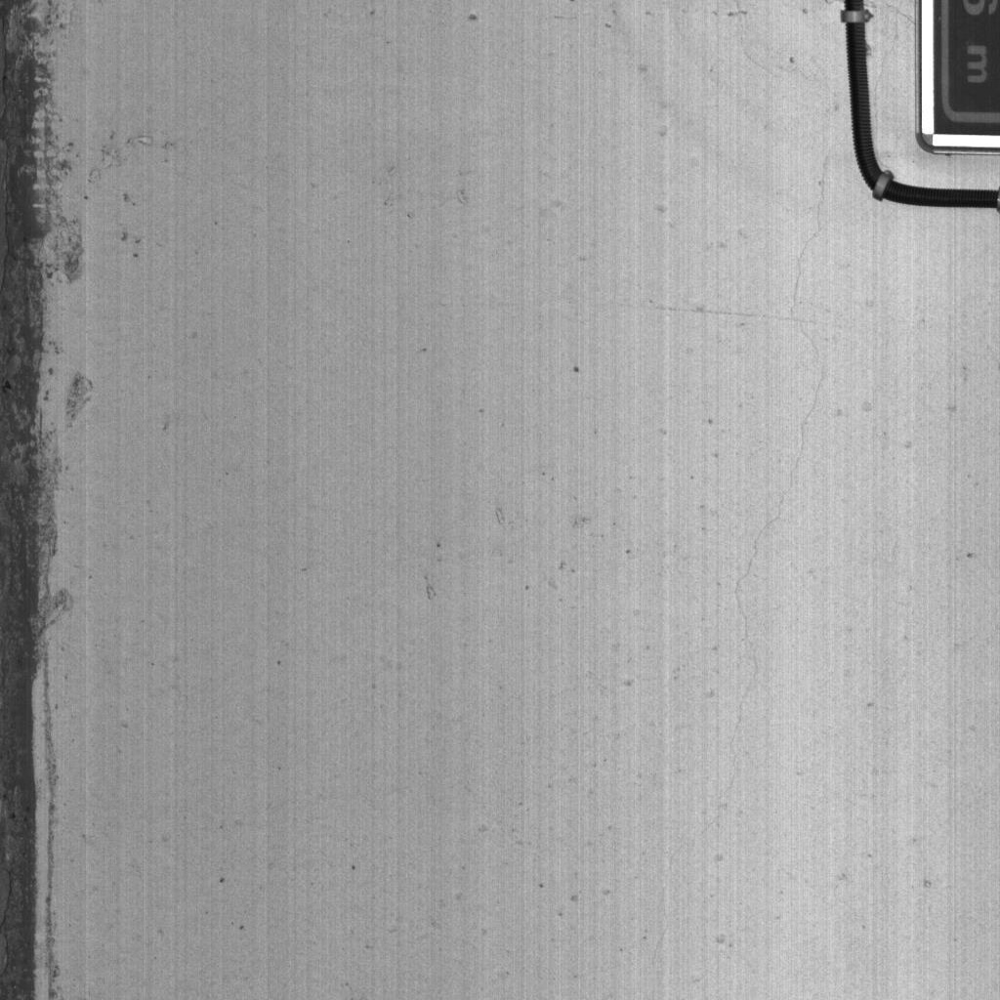
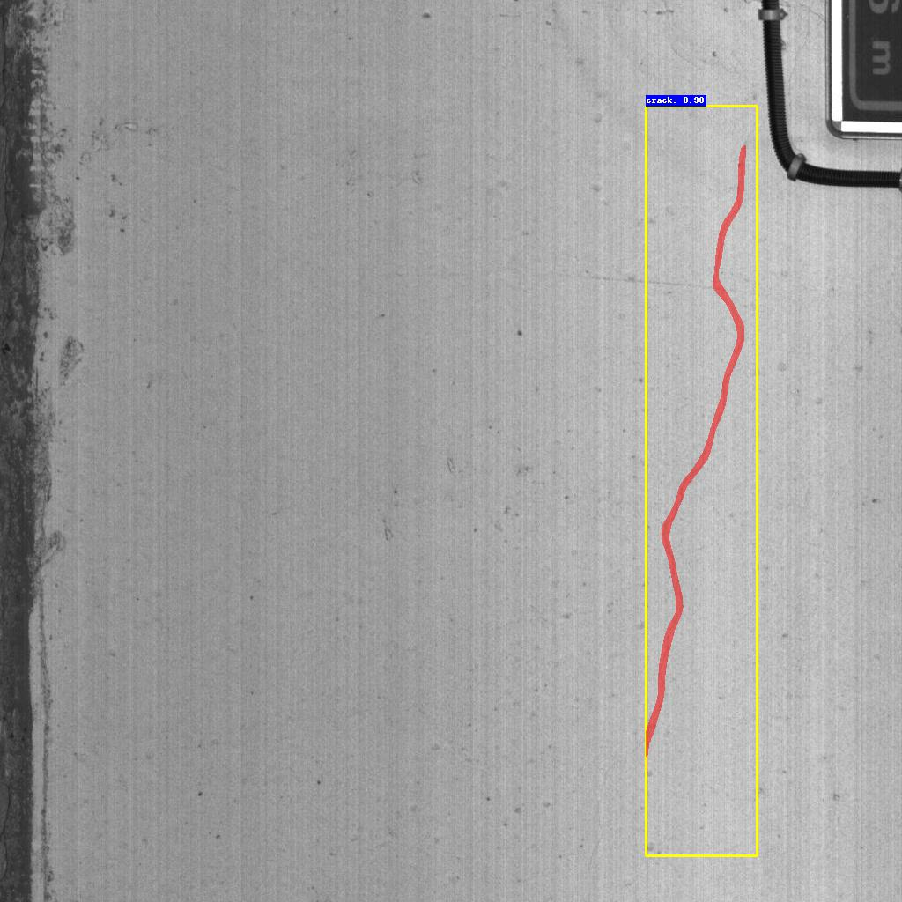

# DBT Mask-R-CNN: Learning Dynamical Binary Threshold for Crack Instance Segmentation

We provide the codes, the datasets, and the pretrained model.

## Pretrained Models

Pretrained models on PyTorch are available at,

https://pan.baidu.com/s/1ZxzhWEvcXf03aHVAqpw5Xg?pwd=oydm 
passcode: oydm


## Dataset Format

This project uses the COCO dataset format and the data should be organized as follows

```
data_root/
├── images
│   ├── xxx.png
│   ├── xxy.png
│   └── ...
└── annotations
	├── train_coco_anns.json
	└── test_coco_anns.json

```

## Dataset

CrackTunnel1K, Crack500, GAPs v2, CrackLS315 dataset are used in paper.

Our coco annotation files can download from the following link,

https://pan.baidu.com/s/1TqDhRMw20VQeeMi-vHgxaA?pwd=mm5i 
passcode：mm5i

Due to confidentiality, image data can be downloaded from the links provided in their corresponding papers.

## Train without CCAF

Before you start training, please format the data to the above data format and set the dataloader correctly according to the script under the dataset dictionary.

```
python train.py --data-path "data_root_path"
```

## Train with CCAF

Using CCAF, the data is first enhanced by augmenting the train.json and test.json files in the annotations directory to train_imp.json and test_imp.json.

Then go training.

```
python dilate_crack_coco.py --coco "path/to/train.json" --save "path/to/train_imp.json" --k 2
python dilate_crack_coco.py --coco "path/to/test.json" --save "path/to/test_imp.json" --k 2
python train.py --data-path "data_root_path" --imp 1
```

## Predicted Results Visualization

Script *predict.py* provide  predicted visualization for a single image 

```
python predict.py --weight_path "weight_path" --img_path "img_path" --DBT 0 --k 0 
```

## Test

The test data format is still COCO format, please adapt it according to the corresponding file in the dataset directory

```
python test.py --data-path "data_root_path" --weights-path "weight-path" --k2 0 --DBT 0
```

## Some toy_images
Some toy_images can be found in dictionary *toy_images* 

And the predicted results can be found in dictionary *results*




## Copy Right

This dataset was collected for academic research.

## Contact

For any problem about this dataset or codes, please contact Dr. Qin Lei (qinlei@cqu.edu.cn)

